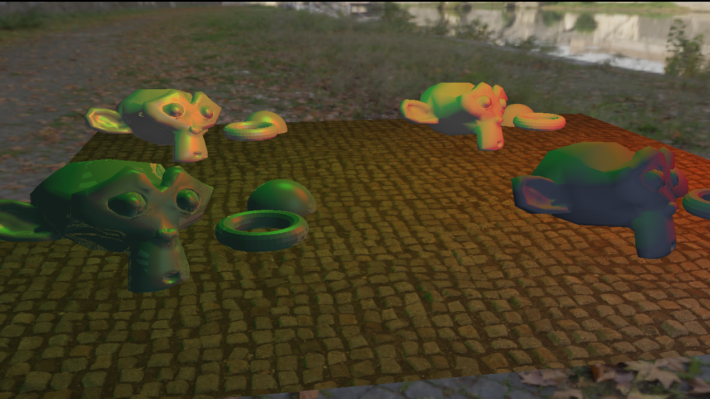

# TetraEngine
A rendering Engine in OpenGL 4.3

This is a small attempt at learning openGL and graphics rendering in general.
For now I can load basic wavefront models and give associate materials to them.
I managed to get some simple shapes and shaders to render including parralax occlusion mapping and specularity.

I have a basic rendering pipeline that offers the ability to do post processing.

There are 2 main projects here, one library that handles the whole 3D thing, loading and stuffs.
One is a tool to load, visualize, edit and save scenes. The editor is built on the seconf part: the rendering library. TetraVisu the editor is just a Gui built using ImGui for the functionalities of the rendering library TetraRenderLib.

you can call ./TetraVisu.exe scenes/saved.json to load a scene. In future releases there should be more than one available.

## Main features
- object loading and display
- cube maps
- multiple texture channels for normal, specular, Parralax Occlusion Mapping...
- a scene loader that uses JSON files tailored to this engine that can load models, shaders, materials, lights that can project orthogonal shadows.
- scenes can also be saved.
- realtime shadows with light maps.
- Possibility to mix deferred and forward rendering.
- depth of field post processing effect.
- Bloom
- Gamma Correction
- Tone mapping
- shader preProcessor that allows to understand #include directives to allow for easier shader writing.
- materials can get the uniforms used by it's shader, and offer an interface to edit them if the uniform is of type vec3, float or sampler2D.
-a complete user interface to edit rotation, scale position of objects, add textures, create new materials, recompile shaders, edit material values depending on the content of the shaders, and a tree of items where nodes, lights and object can be added, edited, removed or copy/pasted.
-asynchrnous texture and mesh loading, it's faster and doesn't block the UI anymore

## wanted features
- more scene files to hilight different features
- cascaded shadows
- instanciation for particle system.
- use tiled rendering and a compute shader to diminish the amount of light/fragment calculation.

It is all very simple, but allowed me to learn about a lot of different techniques. And I try to build the library so it is easy to add more to it fast.

Some images of it :
a scene with loaded obj models that show cases complex meshes

The editor

screen space reflections

realtime shadows with shadowmaps

Before/after picture showing parralax

different values of color and specularity for different materials using the same shader

